# ベストプラクティスの応用可能性
<!--
_class: lead
_paginate: false
_header: ""
-->

## ベストプラクティスの課題
- 形式的な実践に留まってしまう
  - デイリースクラムが単なる進捗報告会になる
- マネージャーがチームの自律性を尊重しない
  - マネージャーの干渉によるアジャイル開発の柔軟性の低下
- チーム内で技術的な意思決定ができない
  - 承認を得るために毎回エスカレーションが必要になる

## 課題に対する疑問
- ベストプラクティスを「正しく」実践しているのに、なぜ効果が出ないのか？
- 同じ手法でも、なぜ組織によって結果が異なるのか？

## ルールの抽象度
<figure style="max-width: 30vw;">
  
  <figcaption>図1 ルール階層</figcaption>
</figure>

- 自然言語: 最も基本的な概念
- フレームワーク: 特定領域への応用
- 組織文化: 実世界の制約
- ベストプラクティス: 具体的な実践

## ベストプラクティスによる情報の集約
- ベストプラクティス = 成功事例
- 成功しやすいが、失敗するときもある
- 利点
  - 要点を簡潔に把握できる
- 欠点
  - **文脈（いつ、どのような状況で使うべきか）が分からない…**

## 文脈を構成する言葉
- 伝統的な解釈: 外延と内包による説明
  - 外延: ある言葉が指し示す具体的なものの集合
    - 犬の外延: 実世界に存在する、あらゆる種類の犬
  - 内包: ある言葉が持つ、共通の特徴
    - 犬の内包: 犬は吠える
- しかし、伝統的な解釈では説明できない言葉がある

## 「ゲーム」には内包がない
ボードゲーム、カードゲーム、ボールゲーム、鬼ごっこなどの全てのゲームに共通する特徴はない
つまり、ゲームという外延は「内包」によって定義されない
実際は「家族的類似性」によって定義されるのではないか？
### 家族的類似性
ある集合の要素が、それぞれ異なる特徴を部分的に共有し、全体として「家族」を形成している状態

## 「ゲーム」の家族的類似性
- ボードゲーム（A）とカードゲーム（B）は、道具を使う
- カードゲーム（B）とボールゲーム（C）には、勝ち負けがある
- ボールゲーム（C）と鬼ごっこ（D）には、競争がある
- ボードゲーム（A）では戦略的思考が重要だが、鬼ごっこ（D）では本能的な反応が重要（A ≠ D）
- AからD（外延）は、**家族のように部分的に似ている**
  - これを「家族的類似性」という

## 言葉の2通りの解釈
- 外延と内包による解釈
  - 例: アジャイル開発は、スクラム、XPなどのフレームワークの集合（外延）であり、設計から実装までを短いサイクルで行う（内包）
- 家族的類似性による解釈
  - スクラム（A）とXP（B）には、スプリントがある
  - XP（B）とカンバン（C）は、作業を可視化する
  - カンバン（C）とリーン（D）は、無駄を排除する
  - スクラム（A）はタイムボックスだが、リーン（D）は連続フロー

## なぜ文脈が重要なのか？
アジャイル開発の例で示したように、ベストプラクティスは部分的な共通点によって成立

したがって、**ベストプラクティスとは、成功事例が部分的な共通点によって結びついたもの**

ベストプラクティスを導入する際は、その手法や原則が、どの文脈に共通する解決策なのか（どの文脈において有効なのか）を知る必要がある
