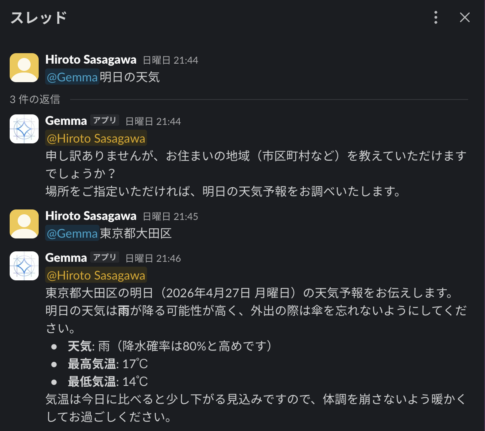

<!--
_class: lead
_paginate: false
_header: ""
-->
# Gemma 3 → 4で何が変わったのか？<br><small>- いつでも使えるローカルLLMの話 -</small>

笹川 尋翔

## Gemma 4が登場
- 2026年4月、Gemma 4の登場によりローカルAI環境が激変
- 2025年リリースのGemma 3から約1年でメジャーアップデート
- 性能と機能の両方が改善され、実用性が向上

## 改善点1: コンテキスト長が増加
- Gemma 3: 最大128,000トークンのコンテキストを導入
- Gemma 4: 最大256,000トークンに増加
- 技術仕様書、数万行のコード、長い議事録を一度に処理可能
- RAGなしでも、コンテキスト内で高い正解率を維持
- 小型モデル（E2B/E4B）でも128Kという高い水準を確保

## 改善点2: 音声、動画をネイティブで処理可能に
- Gemma 3: テキストに加え、画像入力をネイティブに理解
- Gemma 4: 音声、動画へのネイティブ対応を実現
- 動画内の時間的な変化や因果関係を論理的に説明可能
- 「見て、聴いて、話す」ローカルAIエージェントの基盤に

## 改善点3: Tool Useにネイティブで対応
- Tool Use
  - 外部の道具（プログラム、APIなど）を自ら活用し、<br>タスクに取り組む機能
- Function Calling（関数呼び出し）とも呼ばれる
- タスクを自律的に行うエージェント型AIとしての性能が向上

## 改善点4: 思考（Thinking）が可能に
- Chain-of-Thought（CoT）により論理的なミスが減少

| | Gemma 4<br>31B | Gemma 4<br>26B A4B | Gemma 3<br>27B|
| --- | --- | --- | --- |
| MMLU Pro | 85.2% | 82.6% | 67.6% |
| AIME 2026 | 89.2% | 88.3% | 20.8% |
| LiveCodeBench v6 | 80.0% | 77.1% | 29.1% |
| GPQA Diamond | 84.3% | 82.3% | 42.4%|


## 改善点5: 推論速度が向上
- Gemma 4 26B A4BはMoE（Mixture of Experts）を採用
- 推論時に活性化するのは約4Bのみ
- Gemma 3 27Bを超える知能を、より低負荷で提供
- 32GB以上のメモリを搭載したMacBook Proで快適に動作

## 改善点6: 商用利用が可能に
- Gemma 3: Gemma Terms of Use（独自ライセンス）
  - ライセンスの継承（Share-alike）が必要
  - 商用利用が制限
- Gemma 4: Apache 2.0ライセンス
  - Open Source Initiative （OSI）が承認
    - 法的リスクが低い
  - 商用利用が可能

## Gemma 3 27B vs Gemma 4 26B A4B

|| Gemma 4 27B | Gemma 4 26B A4B |
|---|---|---|
| コンテキスト長 | 128,000 | 256,000 |
| マルチモーダル対応 | テキスト、画像 | テキスト、画像、音声、<br>動画 |
| Tool Use | プロンプトで対応 | ネイティブで対応 |
| Thinkingモード | 利用不可 | 利用可 |
| アーキテクチャ | Dense | Mixture of Experts |
| ライセンス | 独自ライセンス | Apache 2.0ライセンス |
## 活用例: 検索機能が付いたSlack Bot
```python
def search_web(query: str) -> str:
    """
    インターネットで最新情報を検索し、結果のリストを返します。
    """
    try:
        with DDGS() as ddgs:
            results = [r for r in ddgs.text(query, max_results=5)]
        return json.dumps(results, ensure_ascii=False)
    except Exception as e:
        return f"Search Error: {e}"
```

## 活用例: 検索機能が付いたSlack Bot
```python
def visit_website(url: str) -> str:
    """
    指定されたURLのウェブサイトにアクセスし、そのテキスト内容を取得します。
    """
    try:
        response = requests.get(url, timeout=10)
        response.raise_for_status()
        soup = BeautifulSoup(response.text, 'html.parser')

        for script_or_style in soup(["script", "style", "header", "footer", "nav"]):
            script_or_style.decompose()
        text = soup.get_text(separator=' ', strip=True)
        return text[:5000]
    except Exception as e:
        return f"Error visiting website: {e}"
```

## 活用例: 検索機能が付いたSlack Bot
<style>
img {
  display: block;
  margin: 0 auto;
}
</style>




## 参考文献
- "Gemma 4 モデルカード". Google AI for Developers. https://ai.google.dev/gemma/docs/core/model_card_4
