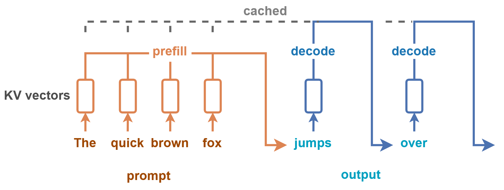
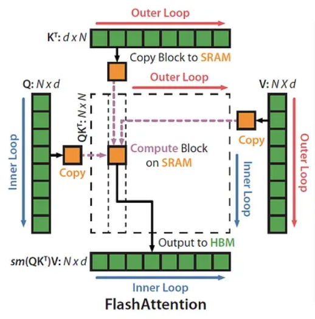
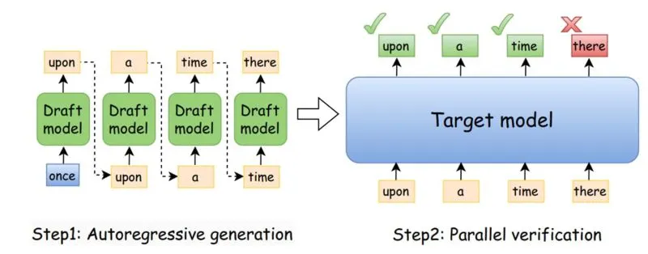
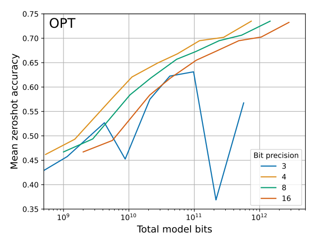

<!--
_class: lead
_paginate: false
_header: ""
-->
# 自分のPCでサクサク動く！ <small>- ローカルLLMの推論速度を上げる方法 -</small>

笹川 尋翔

## なぜ「推論速度」が重要なのか？
- 自然に文章を読む速度を維持できない
-> ストレスを感じさせる
  - 次の指示出しや修正までの時間が短いほど良い

- 1秒間に処理できるトークン数が多い
-> 並列処理が容易

- AIが繰り返し思考（Chain of Thought）できる
-> エージェントとしての性能が高くなる

## LLMの推論プロセス
1. Prefill（プロンプト処理）

ユーザーが入力したプロンプト全体を読み込み、解析する工程

TransformerモデルのSelf-Attentionにおいて、計算量は$O(n^2)$

2. Decode（逐次生成）

解析結果を基にトークンを1つずつ順番に生成する工程

## LLMの推論プロセス
<figure>
  
  <figcaption>
  <a href="https://huggingface.co/blog/tngtech/llm-performance-prefill-decode-concurrent-requests"><small>出典: Prefill and Decode for Concurrent Requests - Optimizing LLM Performance</small></a>
  </figcaption>
</figure>

## LLMの推論性能の評価指標
- Prefillの場合: TTFT（Time To First Token）
  - 最初の1トークン目が出るまでの時間
  - 画面に最初の文字が表示されるまでの「待ち時間」

- Decodeの場合: TPS（Tokens Per Second）
  - 1秒あたりに生成されるトークン数
  - 最初の文字が出た後の「書き込み速度」

## Prefillの高速化: FlashAttention
- メモリへの読み書きを減らすことで高速化

- Tiling（タイリング）
  - 行列をブロックに分割して計算し、SRAMを効率的に活用
- Recomputation（再計算）
  - 逆伝播時に中間結果をメモリに保存せず「計算し直す」
  - メモリからの読み込み待ちがなくなり、速くなる

## Prefillの高速化: FlashAttention
<figure>
  
  <figcaption>
  <a href="https://gordicaleksa.medium.com/eli5-flash-attention-5c44017022ad"><small>出典: ELI5: FlashAttention</small></a>
  </figcaption>
</figure>

- HBM（緑色のブロック）:

容量が大きい
読み書きの速度が遅い

- SRAM（オレンジ色のブロック）:

読み書きの速度が非常に速い
容量が極めて小さい

## Prefillの高速化: Prompt Caching
- システムプロンプトなどの共通の入力部分の計算結果を再利用
- キャッシュヒット時: TTFTがミリ秒単位に

## Decodeの高速化: Speculative Decoding
- 小さなモデルを使用して初期の予測を行う
  -> その結果を大きなモデルが検証

ドラフトモデル（小さなモデル）: 高速に動作
ターゲットモデル（大きなモデル）: 高精度だが低速

1. Drafting: ドラフトモデルがトークンを生成
2. Verification: ターゲットモデルがトークンを検証
3. Acceptance: ターゲットモデルの判断と一致したトークンを承認

## Decodeの高速化: Speculative Decoding

<figure>
  
  <figcaption>
  <a href="https://medium.com/@genai.works/speed-up-llm-inference-with-speculative-decoding-1fc79701e9d6"><small>出典: Speed Up LLM Inference with Speculative Decoding</small></a>
  </figcaption>
</figure>

## Decodeの高速化: KV Cache Quantization
KVキャッシュを低ビットに圧縮して保存

Decode時: メモリからデータを読み出す速度がボトルネックに

KVキャッシュを量子化すると、メモリのI/O待ち時間が減少

## 共通技術: Weight Quantization
モデルのパラメーターの精度を下げ、メモリ消費量を減らす

16ビットで保持 -> 4ビットなどに圧縮

## 共通技術: Weight Quantization

| フォーマット | 特徴 | 主な用途 |
| :--- | :--- | :--- |
| GGUF | CPU + GPU で動作 扱いやすい | Mac、グラボがないPC |
| EXL2 | GPU向け bit数を細かく指定 | 高速なレスポンスを求める場合 |
| AWQ / GPTQ | GPU向け 広く普及している | サーバー構築やGPUによる推論 |

## 共通技術: Weight Quantization

- 合計メモリサイズを考慮すると、4ビット量子化が最も精度が高い

## 比較表

| 改善項目 | 技術 | メリット | デメリット |
| :--- | :--- | :--- | :--- |
| TTFT | `FlashAttention` `Prompt Caching` | 待ち時間を 短縮 | なし |
| TPS | `Speculative Decoding` | トークン生成を高速化| メモリ消費量が増える |
| メモリ占有量 | `Weight Quantization` | 巨大なモデルが動く | 精度が低下 |
| メモリ消費量 | `KV Cache Quantization` | 長文を扱える ようになる | 精度が低下 |

## まとめ

- 待ち時間を減らしたい
  - `FlashAttention` の有効化と `Prompt Caching` の活用

- 生成速度を上げたい
  - `Speculative Decoding` や `KV Cache Quantization`

- メモリが足りない・手軽に試したい
  - `GGUF` 形式での4ビット量子化

## 参考文献
- T. Dettmers and L. Zettlemoyer, "The Case for 4-bit Precision: k-bit Inference Scaling Laws," in Proceedings of the 40th International Conference on Machine Learning, vol. 202, 2023, pp. 7750-7774.
