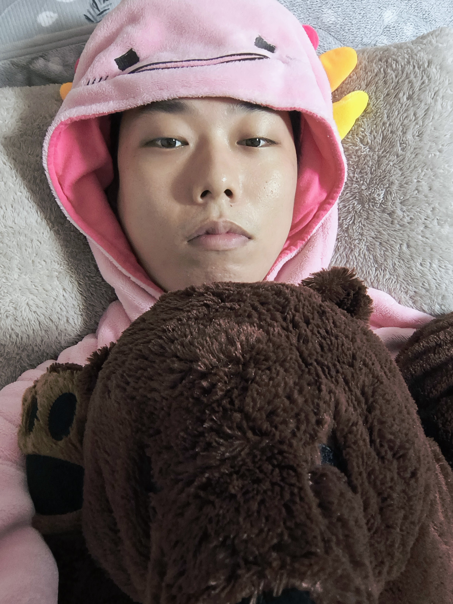

## 自己紹介
- 名前: 笹川 尋翔（ささがわ ひろと）
- ニックネーム: さめちゃん
- 年齢: 23歳
- 趣味: 哲学、ぬいぐるみ、爬虫類
- 座右の銘: 「幸福だから笑うのではなく、笑うから幸福なのだ」

## 自己紹介
### 私についての豆知識
ソフトウェアエンジニアだけど…

**デジタル（2次元）よりもアナログ（3次元）に興味がある**

アナログは知覚情報が豊富だが、デジタルには平面の制約があるから

### 1日時間が空いたら何がしたいか
新しいことを学ぶ => 自分の言葉で表現 => 外に向けて発信
